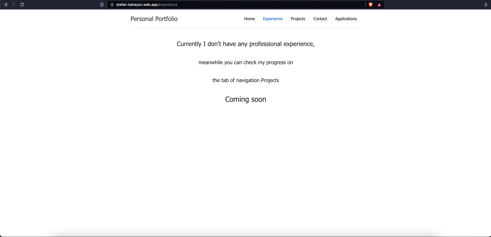

### Portfolio-Web-Site

This is my personal portfolio web site

Uses React for the front end. It uses GitHub Action for CI/CD

For the Projects tab it fetches data from the GitHub API to fill the cards with information 

The url for the site is: https://stefan-kehayov.web.app
# Images of the website

